# -SEMI1-GRUPO8
Repositorio del Grupo 8 para la práctica 1 del curso Seminario de Sistemas 1 ☝️🤓

 **Carnet** | **Nombre** |
| ------ | ------ |
| 201900647 | Eduardo Josué González Cifuentes |
| 201902301 | Piter Angel Esaú Valiente de León |
| 201901756 | José Andrés López Pineda |

# Manual de Configuración

## Descripción de la arquitectura

La arquitectura de esta practica consiste en diferentes servicios de AWS.

Tenemos una página web hospedada en un bucket de s3 (almacenamiento de
objetos), esta página envía peticiones hacia un balanceador de carga.
La carga es balanceada entre dos instancias de ec2 (máquinas virtuales), en
donde se encuentra el backend. Cada instancia corre una API, programada una en
Python y otra con Javascript. 

Ambas instancias de ec2 guardan y modifican información en una instancia de
PostgreSQL (en RDS), al igual que guardan imágenes en un bucket de s3.

## Descripción de los usuarios IAM

* Usuario para ec2: se creó un usuario llamado `ec2_user` con la política de
  `AmazonEC2FullAccess`, que le permite realizar todas las acciones posibles
  con ec2; creación, eliminación, detención, ejecución de instancias.

* Usuario para rds: se creó un usuario llamado `rds_user` con la política de
  `AmazonRDSFullAccess`, que le permite realizar todas las acciones posibles
  relacionadas a rds; creación, eliminación, detención, ejecución del
  instancias de bases de datos.

* Usuario para s3: se creó un usuario llamado `s3_user` con la política de
  `AmazonS3FullAccess`, que le permite realizar todas las acciones
  realacionadas a s3; creación de buckets, subida y borrado de archivos,
  vaciado y elminiación de buckets.

## Capturas

### Buckets de S3

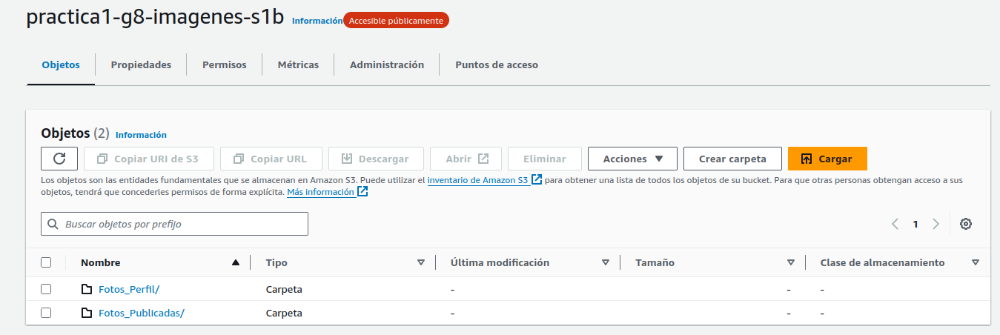

### EC2

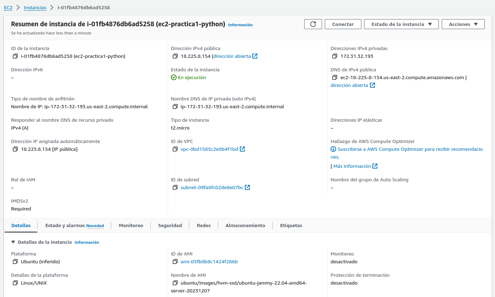

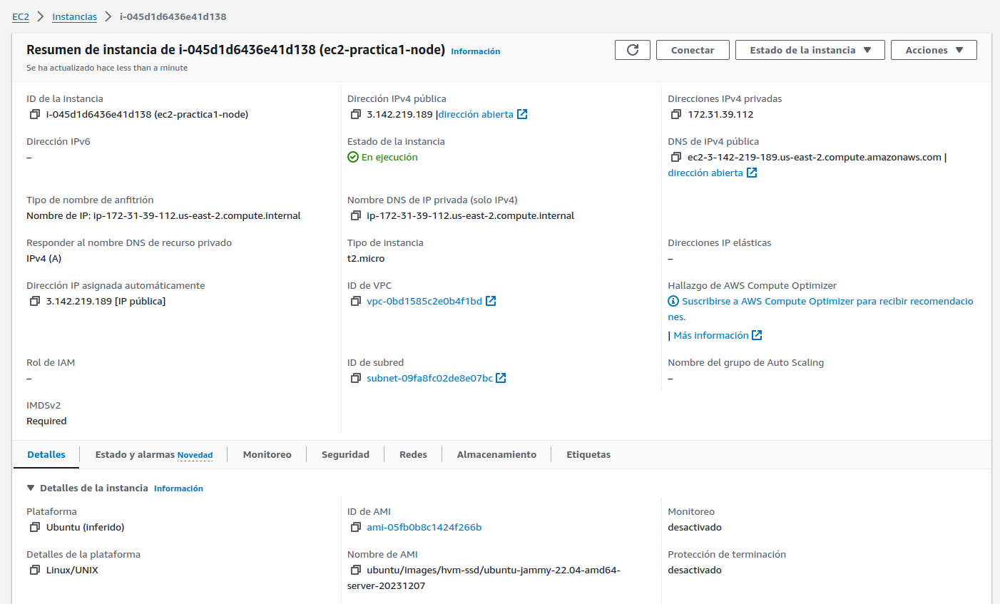

### Base de Datos RDS

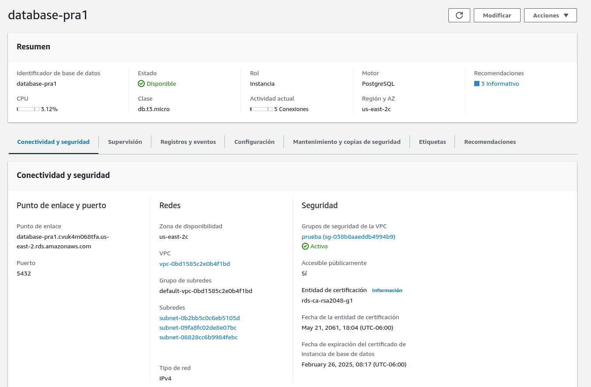

### Aplicación Web
#### Home
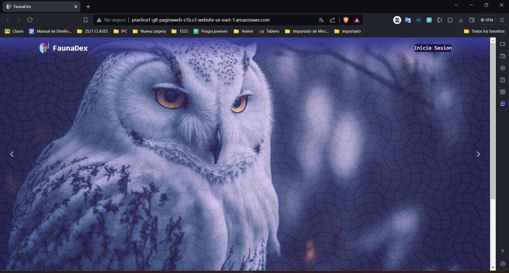

#### Login
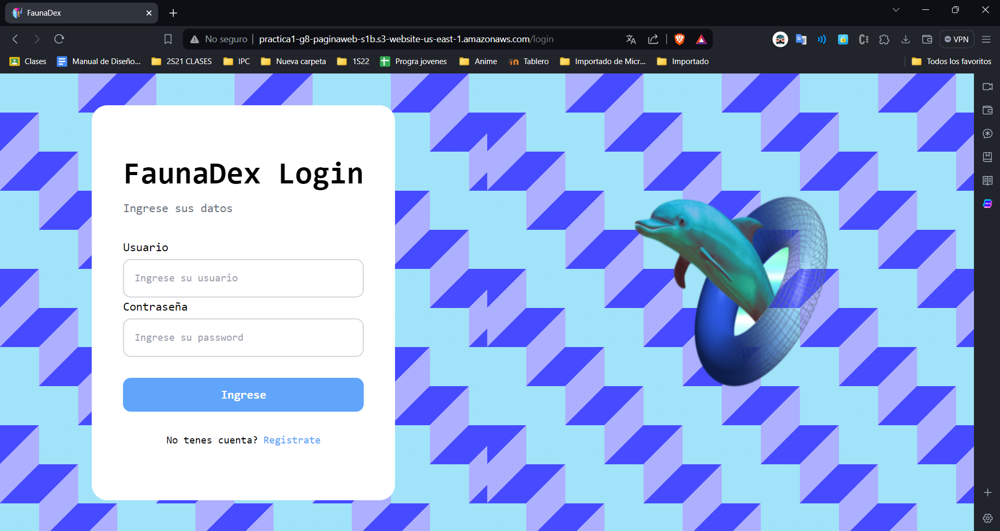

#### Registro
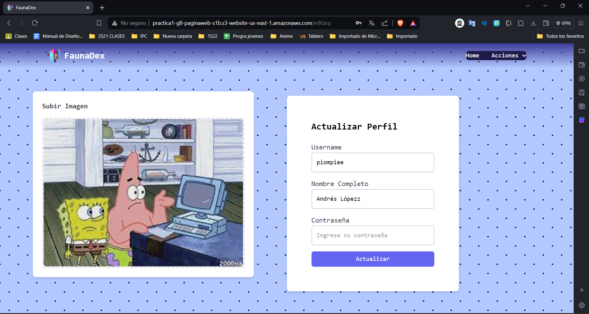

#### Faceid
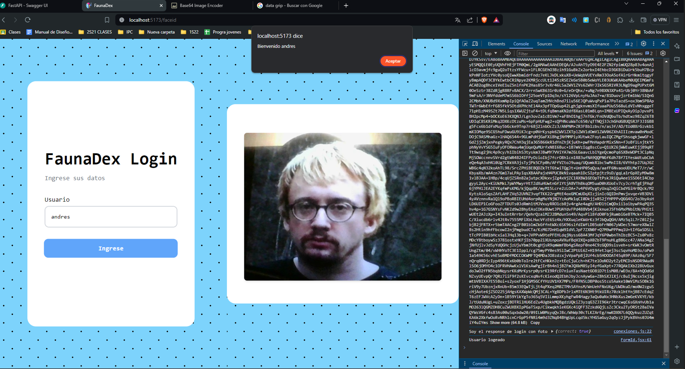

#### Perfil
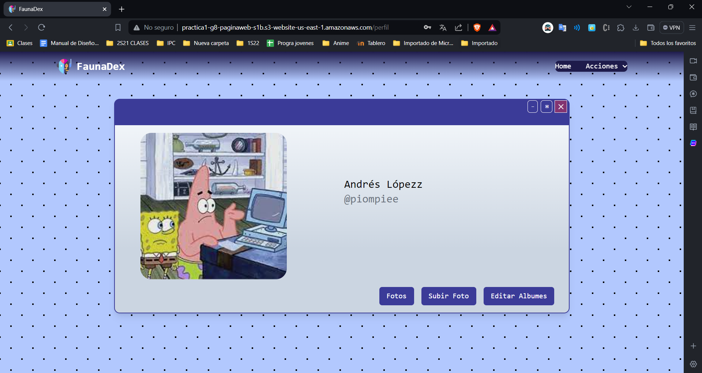

#### Fotos
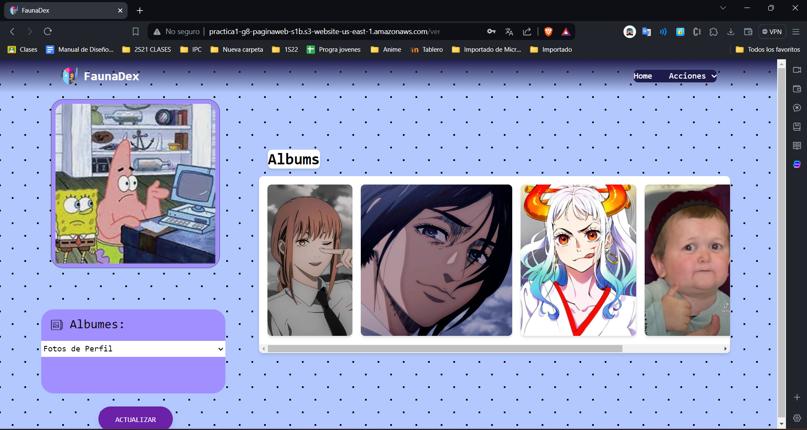

#### Editar Albumes
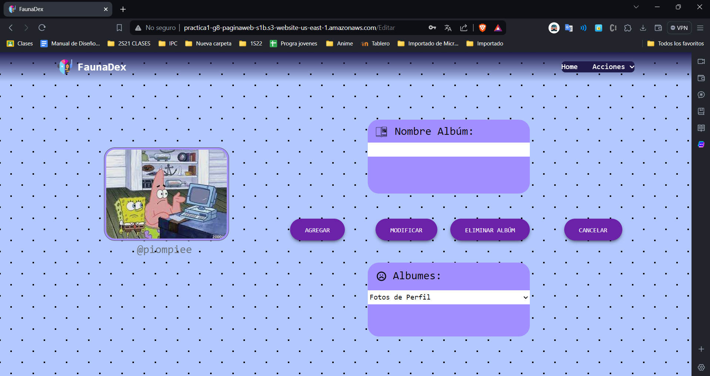

#### Subir Foto
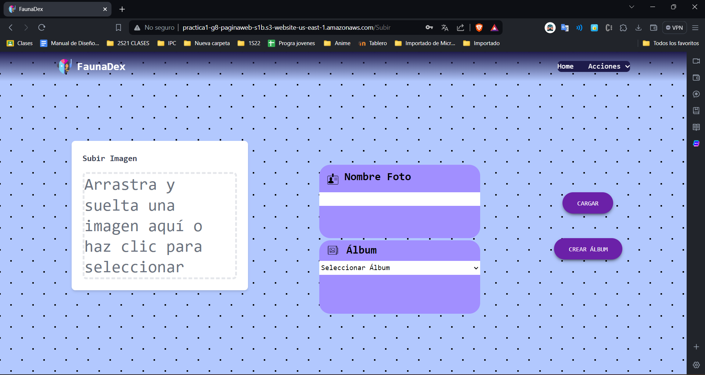

#### Detalles 
