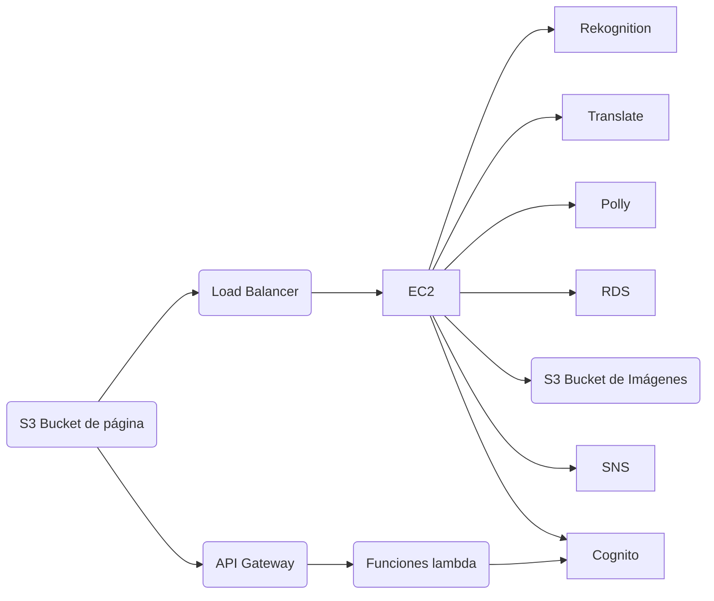

# Manual técnico

## Objetivos del proyecto

## Descripción del proyecto

## Arquitectura

Se hostea la interfaz en un bucket de S3, este realiza peticiones a:
- Un API en API Gateway que utiliza funciones lambda que se comunica con
  Cogntio para realizar operaciones de registro e inicio de sesión de usuarios.
- Un servidor API hosteado en una o múltiples instancias de EC2 detrás de un
  balanceador de carga.

El servidor API utiliza los suigientes servicios:
- **Rekognition**: Reconocer texto de imágenes en el bucket de s3
- **Translate**: Traducir el texto extraído con Rekognition
- **Polly**: Sintetización de voz para el texto obtenido de las imágenes
- **RDS**: Base de datos (PostgreSQL) para almacenar información de series y
  usarios
- **S3**: Almacena las imágenes que componen los capítulos de las series y sus
  caratulas.
- **SNS**: Para enviar mensaje a usuarios sobre las series que siguen
- **Cognito**: Para consultar información de los usuarios, para le creación de
  series privadas y suscripciones a series.

## Presupuesto

| Servicio          | Cuota                             |
| :-:               | :-:                               |
| S3                | 0.021 USD/GB                      |
| EC2               | 0.02  USD/hora (t1.micro)         |
| API Gateway       | 3.50 USD/millón de requests       |
| Funciones Lambda  | 0.20 USD/millon de requests       |
| Cognito           | 0.00055 USD/usuario               | 
| Rekognition       | 0.001 - 0.0004 USD/imagen         |
| Translate         | 15.00 USD/millón de caracteres    |
| Polly             | 4.00 USD/millón de caracteres     |
| RDS               | 33.18 USD/mes                     |
| SNS               | 2.00 USD/100K notificaciones email|

## Servicios utilizados

### S3

S3 es un servicio de almacenamiento en la nube que ofrece escalabilidad,
disponibilidad y durabilidad de datos. Permite almacenar y recuperar cualquier
cantidad de datos desde cualquier ubicación web. Es altamente utilizado para
almacenar archivos estáticos, copias de seguridad, contenido multimedia y datos
para aplicaciones web.

### EC2

EC2 es un servicio que proporciona capacidad informática escalable en la nube.
Permite lanzar y gestionar servidores virtuales (instancias) según las
necesidades de la aplicación. Estas instancias pueden ejecutar una variedad de
sistemas operativos y configuraciones de software, lo que brinda flexibilidad y
control sobre el entorno informático.

### RDS

RDS es un servicio de bases de datos relacionales en la nube que facilita la
configuración, el funcionamiento y la escalabilidad de bases de datos
relacionales como MySQL, PostgreSQL, Oracle y SQL Server. Ofrece
características como copias de seguridad automáticas, escalabilidad vertical y
horizontal, y gestión simplificada.

### Funciones Lambda

Lambda es un servicio de cómputo sin servidor que permite ejecutar código en
respuesta a eventos sin la necesidad de administrar servidores. Permite
ejecutar código en respuesta a eventos como cambios en datos, acciones de
usuarios o solicitudes de API. Se factura según el tiempo de ejecución y la
cantidad de recursos utilizados.

### API Gateway

API Gateway es un servicio totalmente gestionado que facilita la creación,
publicación, mantenimiento, monitorización y protección de APIs. Permite crear
interfaces RESTful y WebSocket para acceder a recursos y servicios backend,
como Lambda o EC2, de forma segura y escalable.

### Cognito

Cognito es un servicio de gestión de identidad y acceso que facilita la
autenticación, autorización y gestión de usuarios para aplicaciones web y
móviles. Permite integrar fácilmente funciones de registro de usuarios, inicio
de sesión social, autenticación multifactor y gestión de identidades en las
aplicaciones.

### Amazon Polly

Polly es un servicio de síntesis de voz que convierte texto en habla realista
en varios idiomas y voces. Permite generar audio de alta calidad para
aplicaciones, sitios web, IVR (Respuesta de Voz Interactiva), audiolibros y
más, con opciones de personalización como el tono, la velocidad y el estilo de
la voz.

### Amazon Rekognition

Rekognition es un servicio de análisis de imágenes y videos que utiliza
inteligencia artificial para identificar objetos, personas, texto, escenas y
actividades en medios visuales. Proporciona capacidades de detección facial,
reconocimiento de celebridades, análisis de contenido inapropiado y más, lo que
lo hace útil para aplicaciones de seguridad, marketing y análisis de contenido
visual.

### Amazon Translate

Translate es un servicio de traducción automática neural que permite traducir
texto de manera rápida y precisa entre idiomas. Utiliza redes neuronales para
mejorar la calidad de las traducciones y admite una amplia gama de idiomas. Es
útil para aplicaciones y sitios web que necesitan ofrecer contenido multilingüe
a los usuarios.

### SNS

SNS es un servicio de mensajería completamente gestionado que permite la
publicación y entrega de mensajes a través de múltiples protocolos, como
HTTP/S, email, SMS y protocolo de mensajería Push (APNS, GCM/Firebase Cloud
Messaging). Es utilizado para la distribución de notificaciones, alertas y
mensajes a gran escala a través de diferentes canales y plataformas. SNS
facilita la integración con otras aplicaciones y servicios de AWS, permitiendo
la automatización de procesos y la implementación de arquitecturas de
comunicación robustas y escalables.
